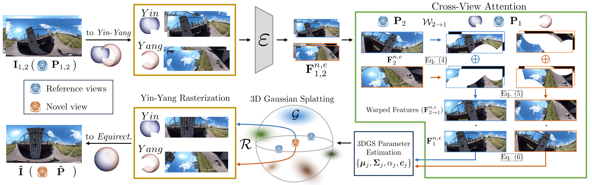

  <h1 align="center">OmniSplat: Taming Feed-Forward 3D Gaussian Splatting for   Omnidirectional Images with Editable Capabilities </h1>
  

    <a href="https://esw0116.github.io/">Suyoung Lee</a>1*
    &nbsp;·&nbsp;
    <a href="https://robot0321.github.io/">Jaeyoung Chung</a>1*
    &nbsp;·&nbsp;
    Kihoon Kim1
    &nbsp;·&nbsp;
    Jaeyoo Huh1
     
    Gunhee Lee2
    &nbsp;·&nbsp;
    Minsoo Lee2
    &nbsp;·&nbsp;
    <a href="https://cv.snu.ac.kr/index.php/~kmlee/">Kyoung Mu Lee</a>1
     
    1: Seoul National Univiersity &nbsp;&nbsp; 2: LG AI Research Center
     
    (* denotes equal contribution)
  

  <h3 align="center">CVPR 2025, Highlight</h3>

<!-- 

 -->

    
    

---
This is an official implementation of ["OmniSplat: Taming Feed-Forward 3D Gaussian Splatting for Omnidirectional Images with Editable Capabilities."](https://arxiv.org/abs/2412.16604)

    

### Update Log
**25.06.06:**   First code upload

## Installation
~~~bash
git clone https://github.com/esw0116/OmniSplat.git --recursive
cd OminSplat

# Set Environment
conda env create --file environment.yaml
conda activate omnisplat
pip install submodules/simple-knn
pip install submodules/diff-gaussian-yin-rasterization
pip install submodules/diff-gaussian-yang-rasterization
~~~

## Benchmark Dataset
We evaluate 6 datasets by adjusting their resolutions and performing Structure-from-Motion using OpenMVG.  
For your convenience, we provide :star:[**links to the converted datasets**](https://1drv.ms/f/c/1ac507ce4eb00e92/EiC-9MH6l-FGsMt7CmEhYSkBarxjOqZfC-0sf2hf7oz_Uw?e=GriAUu):star: used in our paper.
The reference and target indices for each dataset is described in the supplementary material of the paper.

For reference, we provide the links to the **original datasets**.  
[OmniBlender & Ricoh360](https://github.com/changwoonchoi/EgoNeRF) / [OmniPhotos](https://github.com/cr333/OmniPhotos?tab=readme-ov-file) / [360Roam](https://huajianup.github.io/research/360Roam/) / [OmniScenes](https://github.com/82magnolia/piccolo) / [360VO](https://huajianup.github.io/research/360VO/)  

## Running OmniSplat
* OmniSplat runs based on MVSplat, without fine-tuning any parameters.

### Preparation
* Get the pretrained model (re10k.ckpt) from [MVSplat repo](https://github.com/donydchen/mvsplat), and save the model in `./checkpoints` folder
* Put the downloaded datasets in the `./datasets` folder

### Evaluation Scripts
~~~python
python -m src.main +experiment=[dataset_name]
~~~

* The config files are listed in `./config/experiment`
* The results will be saved in `./outputs/test`

### Note
* There will be a pixel misalignment during the omnidirectional image warping.
* To solve the issue, please go to the `equi2equi/torch.py` in `pyequilib` library, and comment the two lines (L33-34) `ui += 0.5; uj += 0.5`
* We will modify the code to resolve the issue without changing the function in the library.

<section class="section" id="BibTeX">
  

    <h2 class="title">Citation</h2>
    <pre><code>@InProceedings{Lee2025OmniSplat,
    author    = {Lee, Suyoung and Chung, Jaeyoung and Kim, Kihoon and Huh, Jaeyoo and Lee, Gunhee and Lee, Minsoo and Lee, Kyoung Mu},
    title     = {OmniSplat: Taming Feed-Forward 3D Gaussian Splatting for Omnidirectional Images with Editable Capabilities},
    booktitle = {Proceedings of the Computer Vision and Pattern Recognition Conference (CVPR)},
    month     = {June},
    year      = {2025},
    pages     = {16356-16365}
}
}</code></pre>
  

</section>
