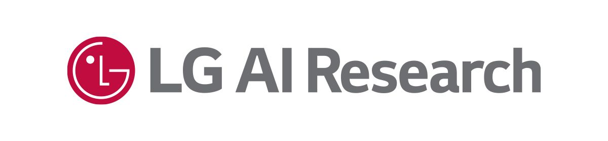

  <h1 align="center">OmniSplat: Taming Feed-Forward 3D Gaussian Splatting for   Omnidirectional Images with Editable Capabilities </h1>
  

    <a href="https://esw0116.github.io/">Suyoung Lee</a>1*
    &nbsp;·&nbsp;
    <a href="https://robot0321.github.io/">Jaeyoung Chung</a>1*
    &nbsp;·&nbsp;
    Kihoon Kim1
    &nbsp;·&nbsp;
    Jaeyoo Huh1
     
    Gunhee Lee2
    &nbsp;·&nbsp;
    Minsoo Lee2
    &nbsp;·&nbsp;
    <a href="https://cv.snu.ac.kr/index.php/~kmlee/">Kyoung Mu Lee</a>1
     
    1: Seoul National Univiersity &nbsp;&nbsp; 2: LG AI Research Center
     
    (* denotes equal contribution)
  

  <h3 align="center">CVPR 2025</h3>

<!-- 

 -->

    
    

---
This is an official implementation of ["OmniSplat: Taming Feed-Forward 3D Gaussian Splatting for Omnidirectional Images with Editable Capabilities."](https://arxiv.org/abs/2412.16604)

### We are now working on code organization. The code will be released in May.
